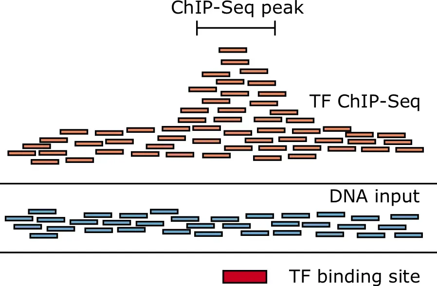
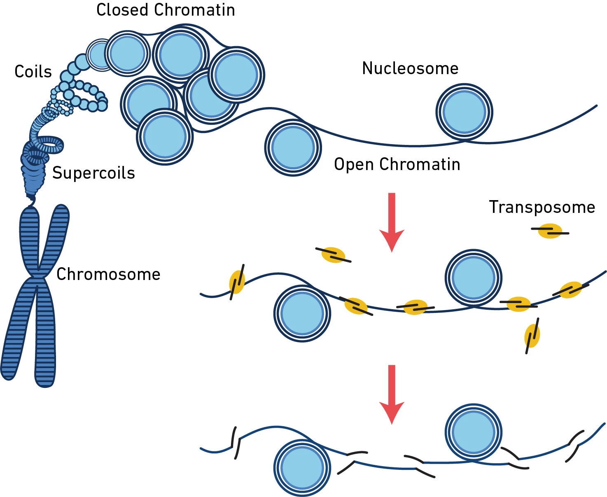

```{r setup, include=FALSE}
knitr::opts_chunk$set(echo = TRUE)
```

# Tutorial 2: Visualizing the Genome

This tutorial will show very simply how to visualize sequencing data directly on the browser. While it is impracticable to visualize the entire genome for any given sample, it can certainly be valuable to "see" what is happening at certain regions-of-interest (i.e. gene loci) - even as a simple sanity check. Here, we will:

1.  Fetch data from ENCODE.
    -   K562 is a Myeloid Leukemia cell line highly characterized under many assays.

    -   TF-ChIP measure where a transcription factor is within the genome. Just because a TF binds somewhere in the genome does not guarantee an explicit function.

    -   ATAC-seq measures where the genome is "open"/accessible - suggesting TFs are more likely to interact in these regions.
2.  Visualize certain (randomly selected) gene loci on UCSC Genome Browser
3.  Visualize in R

These simple techniques will be useful in your final project; while the databases can differ, the file formats are largely standardized across bioinformatics.

## 1. Fetching data from ENCODE

At random, we've selected a transcription factor for this tutorial and chromatin accessibility measurements for K562 cancer-cell line.

K562 bigWig STAT6 TF-ChIP FC over Input/control: [https://www.encodeproject.org/files/ENCFF723LAT/](https://www.encodeproject.org/files/ENCFF723LAT/@@download/ENCFF723LAT.bigWig){.uri}

K562 bed ATAC Peaks: <https://www.encodeproject.org/files/ENCFF706RJP/>

*In a "robust" bioinformatic pipeline/script you would utilize wget or curl to problematically download files into your desired location rather than manually as done here.* **Why?**

{width="508"}

{width="507"}

## 2. Visualizing on the UCSC Browser

The UCSC genome browser is a quick and easy way to visualize publicly available data, particularly if you have qualitative questions in mind. Eg. Does geneX's promoter (upstream of the start site) contain higher binding sites for our TF and open chromatin?

Go to: <https://genome.ucsc.edu/index.html> -\> Click "Genome Browser"

-   There are a lot of basic, default things shown in the browser. You can "hide all" and/or manually toggle overlays of interest. Remember to click refresh once you're done.
-   At the "My Data" tab, you can add custom tracks. In the custom tracks we will add the URLs of the files directly. Right click the "Download xyz" and click "copy link", paste the link as a custom track. This way the browser will directly download/fetch the file of interest.

You can explore genes of interest - try to find cancer-related or STAT6-associated genes with high TF-ChIP signal and open chromatin. Does this mean that STAT6 is binding and serving a function? Can you determine the answer via dry-lab or wet-lab techniques?

## 3. R-based Visualization

If you do not already have Rtools, it is worthwhile installing the appropriate version for your R installation from: <https://cran.r-project.org/bin/windows/Rtools/>.

-   Installation can take time, but can be useful for compiling libraries/packages, particularly if they are not pre-compiled for certain OS-R combinations.

-   Ensure you add Rtools to environment variables on Windows OS: environment variables -\> System variables -\> Path -\> edit (C:\\rtools44\\usr\\bin; C:\rtools45\\x86_64-w64-mingw32\bin).

    -   Type "make" in your cmd to confirm it worked. And "where make" to see the it's coming from the added path. You will now need to relaunch Rstudio/restart R for it to work here too.

```{r}
if (!requireNamespace("BiocManager", quietly=TRUE))
  install.packages("BiocManager")

BiocManager::install(c("rtracklayer","GenomicRanges","Gviz","biomaRt"))
```

```{r}
library(rtracklayer)
library(GenomicRanges)
library(Gviz)
library(biomaRt)
```

```{r}
## FOR TRANSPARENCY, THE FEW CODE BLOCKS BELOW ARE FROM CHATGPT

# below are your inputs
chip_bw   <- "ENCFF723LAT.bigWig"   # ChIP-seq signal (bigWig)
atac_bb   <- "ENCFF706RJP.bigBed"    # ATAC-seq peaks (bigBed)
genome_id <- "hg38"  # we are working with the hg38 genome build in this example

# region of interest
roi <- GRanges(
  seqnames = "chr17",
  ranges   = IRanges(start = 7650000, end = 7690550)
)
chr <- as.character(seqnames(roi))

## Import only data overlapping ROI
chip_gr <- import(BigWigFile(chip_bw), which = roi)
atac_gr <- import(BigBedFile(atac_bb), which = roi)

## Gene track (only shows genes overlapping ROI)
## For hg38, Ensembl release varies; this uses current Ensembl by default.
mart <- useEnsembl(
  biomart = "genes",
  dataset = "hsapiens_gene_ensembl"
)

## Protein-coding genes only
geneTrack <- BiomartGeneRegionTrack(
  genome     = genome_id,
  chromosome = chr,
  start      = start(roi),
  end        = end(roi),
  name       = "Protein-coding genes",
  biomart    = mart,
  transcriptAnnotation = "symbol",
  filters    = list(biotype = "protein_coding"),
  # collapseTranscripts = "FILL HERE"
)

## Other tracks
axisTrack <- GenomeAxisTrack()

atacTrack <- AnnotationTrack(
  range      = atac_gr,
  genome     = genome_id,
  chromosome = chr,
  name       = "ATAC peaks (bigBed)"
)

chipTrack <- DataTrack(
  range      = chip_gr,
  genome     = genome_id,
  chromosome = chr,
  name       = "ChIP signal (bigWig)",
  type       = "l"
)

plotTracks(
  list(axisTrack, geneTrack, atacTrack, chipTrack),
  chromosome = chr,
  from       = start(roi),
  to         = end(roi)
)
```
