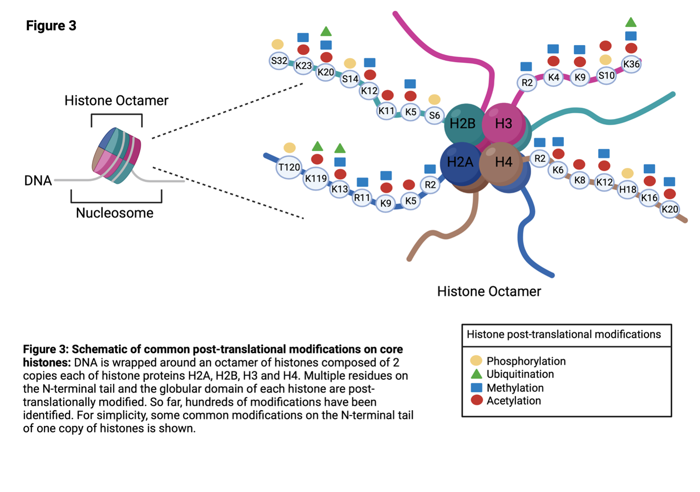
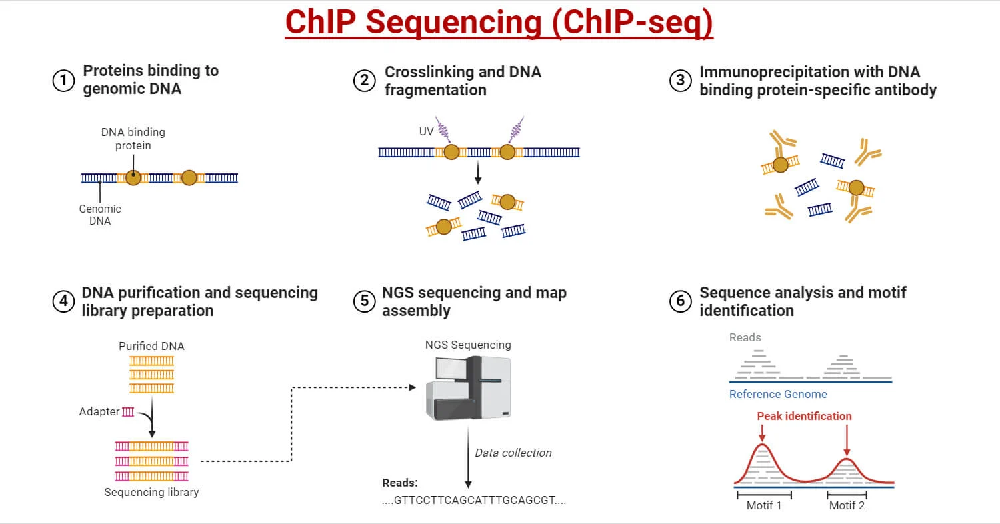
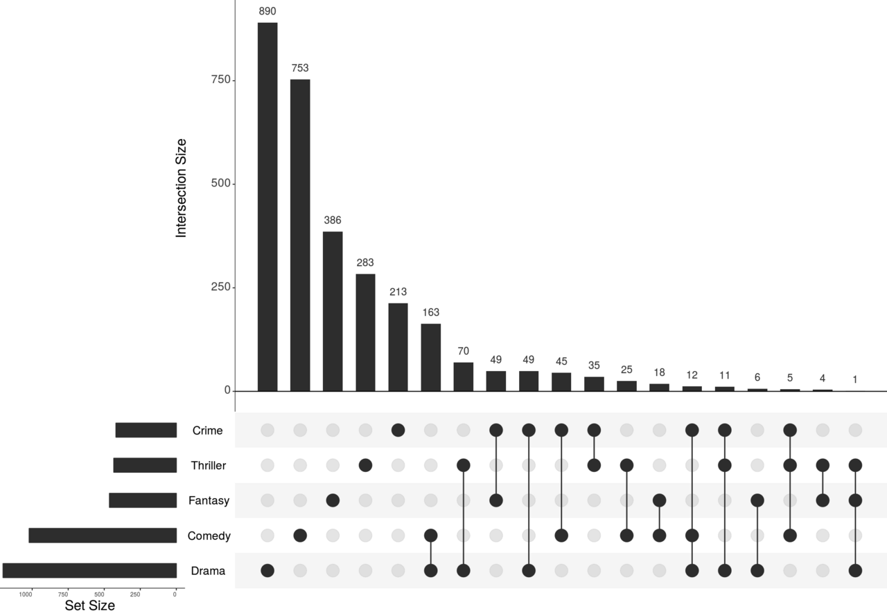
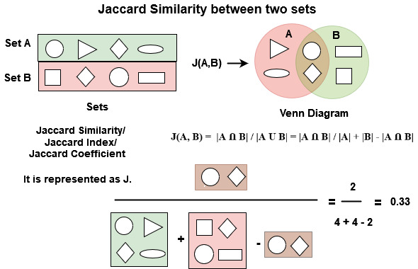

```{r setup, include=FALSE}
knitr::opts_chunk$set(echo = TRUE)
```

# Tutorial 3: Set Intersects in (Epi)Genomics Data

## Biological Background: Histone Marks

The genome is vast; thus, it is common in genomics to restrict your analysis to regions-of-interest (ROIs). Such restrictions are *necessary*, but risk overlooking potential information or insights but also allow one to feasibly extract new (hopefully biological) hypotheses when done robustly. Note, the latter statement is a bit provocative - there are certainly many tools and efforts, particularly in modern biology-"AI" approaches which seek to provide models theoretically capable of digesting and interpreting vast amounts of biology from input data without explicit user-defined intersects.

Here, we utilize six ChIP-seq datasets targeting six standard different histone marks (i.e. one dataset per mark). Their intersects with the genome putatively correspond to transcript start sites, local/distal enhancers, silencers, and generally cis-regulatory regions within the genome. At a simplistic level, marks can be thought of as "repressive" or "active" indicating they negatively/positively influence gene (expression) of regulated genes. Of course biology is never this simple and exceptions certainly exist. Researchers study histone marks as one possible mechanism through which genes are regulated during normal development, or become dysregulated in diseases such as cancer.

[{width="683"}](https://thisisepigenetics.ca/about-epigenetics/epigenetic-control-epithelial-mesenchymal-transition-cancer-metastasis)

[H3K4me1]{.underline} reads:

-   "Histone H3" (which is one of four different histone type on each nucleosome)

-   "lysine 4" (specifying the amino acid/which lysine is being targeted for sequencing)

-   "tri-methylation" (three methyl groups are added to the specified location, i.e. H3K4)

Six standard marks:

-   H3K4me1: Active promotor.

-   H3K4me3: Active or primed enhancers.

-   H3K27ac: Active enhancers and promotors.

-   H3K9me3: Inactive promoters and gene bodies. Repressive polycomb mark.

-   H3K27me3: Broadly across long-term silenced domains/hetrochromatin (compact regions).

-   H3K36me3: Along actively transcribed gene bodies.

Naturally, researchers look at one or more of these marks across the genome to identify ROIs and/or genes-of-interest based on proximity.

## Brief Technical Background: ChIP-seq and Peaks

ChIP-seq experiments are done in a way to "pull" or "extract" only DNA fragments that contain the target-mark (or previously we saw a target-TF). Thus, in bulk-experiments where many cell nuclei are used, you can get a robust average-signal where peaks correspond to consistently "extracted" regions of the genome, with noise associated with technical challenges in the protocol (i.e. you cannot always guarantee only DNA fragments with the mark are extracted), noise in the system, or sequencing/mis-alignments.

[](https://microbenotes.com/chip-sequencing/)

We do not cover the peak identification, or "peak calling", pipeline here. However, a popular tool (MACS2/3) is ubiquitously used in most research - not because there are no alternatives - but because it is usable and makes results easily comparable as each tool often has differing assumptions/statistic for calling peaks.

**Results are stored in BED files.** At their bare minimum, they simply contain regions in the genome using chromosome, start, and end. Example below:

```         
chr1 213941196 213942363 
chr1 213942363 213943530
chr1 213943530 213944697
chr2 158364697 158365864
...
```

<https://learn.gencore.bio.nyu.edu/ngs-file-formats/bed-format/>

## DOWNLOAD DATA AND LIBRARIES/PACKAGES FOR TUTORIAL

### Data

H3K4me1: <https://www.encodeproject.org/files/ENCFF595APD/>

H3K4me3: <https://www.encodeproject.org/files/ENCFF319ENU/>

H3K27ac: <https://www.encodeproject.org/files/ENCFF927NMN/>

H3K9me3: <https://www.encodeproject.org/files/ENCFF145ZIZ/>

H3K27me3: <https://www.encodeproject.org/files/ENCFF993LYR/>

H3K36me3: <https://www.encodeproject.org/files/ENCFF269FSF/>

### Packages

Install below, try to update packages if you want - but if it fails, simply rerun and select "n" (do not update).

```{r, eval=FALSE}
## CRAN packages
install.packages(c(
  "ComplexUpset",
  "ggplot2",
  "dplyr",
  "tidyr"
))

## Bioconductor packages
if (!requireNamespace("BiocManager", quietly = TRUE))
  install.packages("BiocManager")

BiocManager::install(c(
  "rtracklayer",
  "GenomicRanges",
  "IRanges"
))
```

# UpSet Plots: Intersects of Samples/Marks



*Dark dots represent the intersect of movie genres being shown for that bar.* *Some combinations here are not shown as they have intersects of zero.*

```{r}
  library(GenomicRanges)
  library(rtracklayer)
  library(IRanges)
  library(ComplexUpset)   # or UpSetR; ComplexUpset is tidy-friendly
  library(ggplot2)
  library(dplyr)
  library(tidyr)
```

```{r}
files <- c(
  H3K27ac = "h3k27ac_ENCFF927NMN.bed.gz",
  H3K4me1 = "h3k4me1_ENCFF595APD.bed.gz",
  H3K4me3 = "h3k4me3_ENCFF319ENU.bed.gz",
  H3K27me3= "h3k27me3_ENCFF993LYR.bed.gz",
  H3K9me3 = "h3k9me3_ENCFF145ZIZ.bed.gz",
  H3K36me3= "h3k36me3_ENCFF269FSF.bed.gz"
)
stopifnot(all(file.exists(files)))
marks <- names(files)
```

Load the files and extract the regions from the BED file.

```{r}
read_mark_bed <- function(path) {
  con <- gzfile(path, open = "rt")
  on.exit(close(con), add = TRUE)

  # read raw lines, drop BED headers
  x <- readLines(con, warn = FALSE)
  x <- x[!grepl("^(track|browser|#)", x)]
  x <- x[nzchar(x)]
  if (length(x) == 0) stop("No data lines found in: ", path)

  # split on tabs/spaces, keep first 3 fields
  fields <- strsplit(x, "[\t ]+")
  fields <- fields[lengths(fields) >= 3]
  df <- data.frame(
    chrom = vapply(fields, `[[`, character(1), 1),
    start = vapply(fields, `[[`, character(1), 2),
    end   = vapply(fields, `[[`, character(1), 3),
    stringsAsFactors = FALSE
  )

  # coerce to numeric then integer; drop invalid
  df$start <- suppressWarnings(as.numeric(df$start))
  df$end   <- suppressWarnings(as.numeric(df$end))
  df <- df[is.finite(df$start) & is.finite(df$end), , drop = FALSE]
  df$start <- as.integer(floor(df$start))
  df$end   <- as.integer(floor(df$end))

  # BED sanity: start >=0, end > start
  df <- df[df$start >= 0 & df$end > df$start, , drop = FALSE]
  if (nrow(df) == 0) stop("No valid BED intervals after filtering: ", path)

  gr <- GenomicRanges::GRanges(
    seqnames = df$chrom,
    ranges   = IRanges::IRanges(start = df$start + 1L, end = df$end)  # BED 0-based -> GRanges 1-based
  )

  gr <- GenomeInfoDb::keepStandardChromosomes(gr, pruning.mode = "coarse")
  gr <- sort(gr)
  gr <- reduce(gr)
  gr
}

gr_list <- lapply(files, read_mark_bed)
```

Find the union of all genomic regions such that we have a list of all (unique) ranges. Thus, each position is covered by at least a single mark, but potentially more.

```{r}
all_gr <- do.call(c, unname(gr_list))  # GRanges, not list
union <- reduce(all_gr)
union <- sort(union)
union
```

For each region in the union, determine which mark(s) overlap - essentially compute the intersects. Note, each region/row contains atleast one peak, but it doesn't mean that peak spans the entire region - we are making a slight simplification here.

```{r}
# Step 3 membership matrix
membership <- sapply(gr_list, function(grm) {
  countOverlaps(union, grm, ignore.strand = TRUE) > 0L
})

membership_df <- as.data.frame(membership)
head(membership_df)
```

```{r}
# UpSet plot (counts = number of union-tiles)
suppressPackageStartupMessages({
  library(ComplexUpset)
  library(ggplot2)
  library(dplyr)
})

marks <- names(gr_list)  # or your explicit mark names

plot_df <- membership_df %>%
  dplyr::select(dplyr::all_of(marks)) %>%
  dplyr::mutate(dplyr::across(dplyr::everything(), as.logical))

p <- ComplexUpset::upset(
  plot_df,
  intersect = marks,
  base_annotations = list(
    "# Overlapping Peaks" = intersection_size(text = list(vjust = -0.3))
  ),
  set_sizes = upset_set_size()
) +
  ggtitle("Overlapping Histone Mark Peaks (against Unified Regions)") +
  theme(
    plot.title = element_text(size = 16),
    axis.text  = element_text(size = 11),
    axis.title = element_text(size = 13)
  )

ggsave(
  filename = "histone_upset_plot.png",
  plot     = p,
  width    = 25,
  height   = 8,
  units    = "in",
  dpi      = 300
)
```

# Quantifying Intersects

There are plenty of metrics of quantifying overlaps/intersects with nuanced use-case differences between them. Here we will utilize the Jaccard index: $J_{\text{intervals}}=\frac{|A \bigcap B|}{|A \bigcup B|}$ = intersect size / union size.



Below, implement the Jaccard index for and see if you can get the result of:

jaccard_two_marks("H3K36me3", "H3K4me1", membership_df) —\> 0.1176

```{r, eval=FALSE}
jaccard_two_marks <- function(mark1, mark2, membership_df) {
  if (!mark1 %in% colnames(membership_df))
    stop("Unknown mark: ", mark1)
  if (!mark2 %in% colnames(membership_df))
    stop("Unknown mark: ", mark2)

  # extract mark info from membership_df


  # computer intersection

  # compute union


  if (union_n == 0) return(0)
  
  # return jaccard index (write the formula)

}
```

```{r, eval=FALSE}
jaccard_two_marks("H3K36me3", "H3K4me1", membership_df)
```
