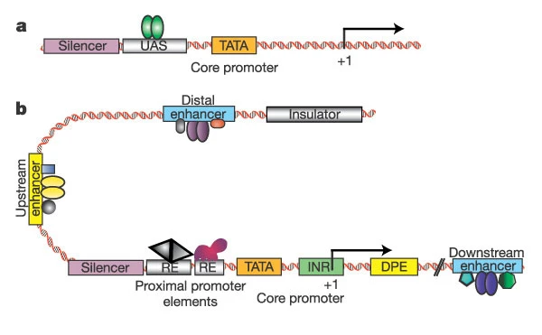
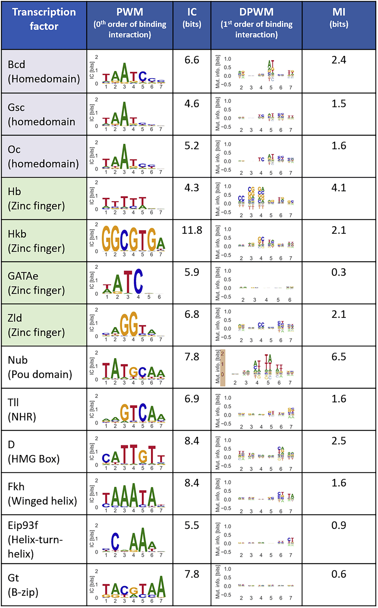
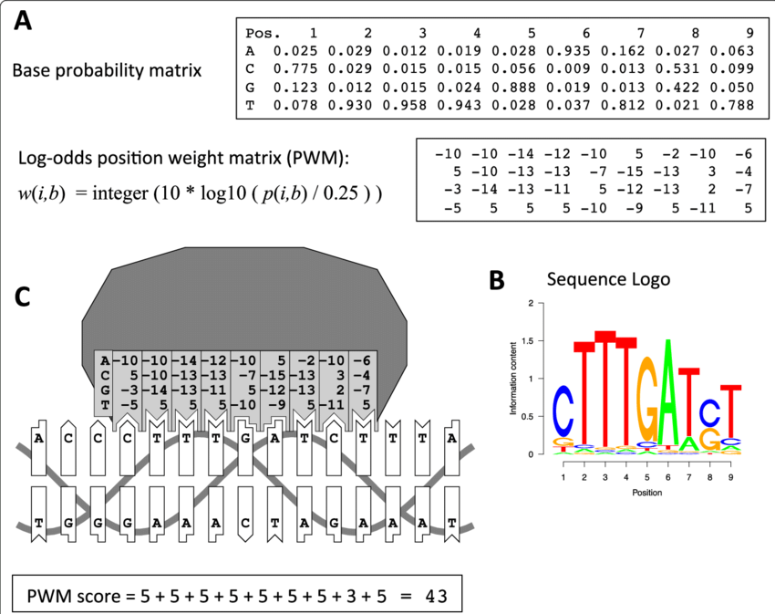

# Tutorial 4: Transcription Factor-Binding Motifs

## Biological Background

The epigenome can regulate the genomic chromatin. However, the simple *presence of certain features like histone/DNA modifications or open chromatin regions does not guarantee gene expression*. Transcription factors (TFs) are specific proteins (encoded by genes) that as another regulatory layer that helps control gene expression. At a simplistic level: TFs bind cis-regulatory elements (CREs, aka regions in the genome which are important for regulating genes' expression) and activate or silence a gene.

[](https://www.nature.com/articles/nature01763#Sec3)

TFs contain DNA-binding domains, or simply regions (sequence of amino acids) which bind DNA. These regions where they bind are known as (binding) motifs. The regions on proteins are often conserved across TFs - with some containing more than one enabling binding at more than one motif.

[{width="510"}](https://www.cell.com/iscience/fulltext/S2589-0042(20)30886-5)

## Technical Background

Position weight matrices (PWMs) matrices are used to represent motifs; they are log transformed versions of a position probability matrix $\in \mathbb{R}^{4 \times L}$. Each represents a binding motif that may be present on one or more TFs.

{width="681"}

Here we will explore the binding of FOXP3 (a TF) against open chromatin regions of the Treg genome. Robust approaches use PWMs and random regions of the genome to generate statistical metrics of whether or not it is enriched in a region (not what we do here).

Note: we have completely ignored HOW these PWM's/binding motifs are discovered. Briefly, one can experimentally find motifs using TF-ChIP and determine if there are recurrent patterns (motifs) where the TF seems to bind and then "matched" to known motifs if possible. You can learn more about this using a search like "*de novo motif discovery from TF ChIP-seq*".

# DOWNLOADS FOR TUTORIAL

## Data

Treg ATAC: <https://www.encodeproject.org/files/ENCFF284FAV/>

## Libraries

```{r}
if (!requireNamespace("BiocManager", quietly = TRUE))
  install.packages("BiocManager")

BiocManager::install(c(
  "GenomicRanges",
  "Biostrings",
  "BSgenome.Hsapiens.UCSC.hg38"
))
BiocManager::install(c("Biostrings", "TFBSTools"))
if (!requireNamespace("ggseqlogo", quietly = TRUE)) install.packages("ggseqlogo")
```

# Which regions is the PWM "most present"

Lets load in open chromatin regions.

```{r}
con <- gzfile("atac_ENCFF284FAV-treg.bed.gz", "rt")

df <- read.table(
  con,
  sep = "\t",
  header = FALSE,
  stringsAsFactors = FALSE,
  colClasses = "character",
  quote = "",
  comment.char = "",
  fill = TRUE
)

close(con)

# Extract first three columns only
dna_regions <- df[, 1:3]
colnames(dna_regions) <- c("chr", "start", "end")

dna_regions
```

Downsample the number of regions purely for tutorial-purposes. In reality you wouldn't just remove regions like this as genomics analysis is done on HPCs.

```{r}
SEED = 82
set.seed(SEED)

n <- nrow(dna_regions)
pct_downsample = 0.1
keep <- sample.int(n, size = ceiling(pct_downsample * n))

dna_regions_ds <- dna_regions[keep, ]

dna_regions_ds
```

Extract DNA sequences from the hg38 genome that these genomes correspond to.

```{r}
library(GenomicRanges)
library(Biostrings)
library(BSgenome.Hsapiens.UCSC.hg38)
```

```{r}
chr   <- dna_regions_ds$chr
start <- suppressWarnings(as.integer(as.numeric(dna_regions_ds$start)))
end   <- suppressWarnings(as.integer(as.numeric(dna_regions_ds$end)))

ok <- !is.na(chr) & !is.na(start) & !is.na(end)

gr <- GRanges(
  seqnames = chr[ok],
  ranges   = IRanges(start = start[ok] + 1L, end = end[ok])
)

## Fetch DNA sequences from hg38
seqs <- getSeq(BSgenome.Hsapiens.UCSC.hg38, gr)

## Character DNA strings
dna_strings <- as.character(seqs)

# remove any strings with unknown nucleotide for simplicity
# Ensure character vector
dna_strings <- as.character(dna_strings)

# Keep only valid DNA sequences (A,C,G,T only)
is_valid_dna <- !is.na(dna_strings) &
                dna_strings != "" &
                grepl("^[ACGTacgt]+$", dna_strings)

dna_strings_clean <- dna_strings[is_valid_dna]

head(dna_strings_clean)
```

Here we will use the FOXP3 TF's matrix. This TF is a known regulator and essential gene in Treg (a specific type of cell).

```{r}
library(Biostrings)
library(TFBSTools)

# Load PFM -> PWM
pfm <- readJASPARMatrix("MA0850.1.jaspar", matrixClass = "PFM")
pwm <- toPWM(pfm)
pwm_mat <- Matrix(pwm)$FOXP3
w <- ncol(pwm_mat)

# Plain character vector
seq_chr <- toupper(as.character(dna_strings))
```

For each region, incrementally apply the PWM and generate the max score plus keep track of its location (for later).

```{r}
# Filter sequences
keep <- !is.na(seq_chr) &
        seq_chr != "" &
        grepl("^[ACGT]+$", seq_chr) &
        nchar(seq_chr) >= w

seq_chr_filt <- seq_chr[keep]

# Return BOTH: max score and the 1-based start position where it occurs (forward strand only)
max_pwm_score_and_pos <- function(seq, pwm_mat, w) {
  s <- DNAString(seq)
  L <- nchar(seq)
  starts <- 1:(L - w + 1L)

  scores <- PWMscoreStartingAt(pwm_mat, s, starting.at = starts)

  i <- which.max(scores)
  c(max_score = scores[i], start_pos = starts[i])
}

# Matrix: rows = sequences; cols = max_score, start_pos
res <- t(vapply(seq_chr_filt, max_pwm_score_and_pos, numeric(2), pwm_mat = pwm_mat, w = w))

res <- as.data.frame(res)
res$start_pos <- as.integer(res$start_pos)

head(res)
```

```{r}

# Histogram
hist(
  res$max_score,
  breaks = 50,
  main = "Distribution of max FOXP3 PWM scores",
  xlab = "Maximum PWM score per sequence",
  ylab = "Count"
)

```

We are not going to determine statistical enrichment, but lets inspect the sequences that score high and low.

```{r}
### CODE FROM CHATGPT

suppressPackageStartupMessages(library(Biostrings))

# Inputs assumed:
# seq_chr_filt : character vector of sequences (filtered)
# res          : data.frame with columns max_score, start_pos (from prior step)
# w            : motif width

# Extract motif-window sequence at the max-score start position
extract_window <- function(seq, start_pos, w) {
  # start_pos is 1-based
  as.character(subseq(DNAString(seq), start = start_pos, width = w))
}

windows <- mapply(
  extract_window,
  seq_chr_filt,
  res$start_pos,
  MoreArgs = list(w = w),
  USE.NAMES = FALSE
)

# Pick "high (~10)" and "low (~0)" by nearest distance (robust)
high_idx <- order(abs(res$max_score - 10))[1:50]  # take top 50 closest to 10
low_idx  <- order(abs(res$max_score -  0))[1:50]  # take top 50 closest to 0

high_windows <- windows[high_idx]
low_windows  <- windows[low_idx]

# Quick text view (first few)
head(data.frame(score = res$max_score[high_idx], start_pos = res$start_pos[high_idx], window = high_windows), 10)
head(data.frame(score = res$max_score[low_idx],  start_pos = res$start_pos[low_idx],  window = low_windows),  10)

# Visualization 1: sequence logos of the aligned windows
suppressPackageStartupMessages({
  library(ggseqlogo)
  library(ggplot2)
})

p_high <- ggseqlogo(high_windows, method = "prob") + ggtitle("High-scoring windows (~10)")
p_low  <- ggseqlogo(low_windows,  method = "prob") + ggtitle("Low-scoring windows (~0)")

print(p_high)
print(p_low)

# Visualization 2 (optional): show the motif window embedded in its local context
# (±20 bp around the start position; adjust flank as desired)
flank <- 20L
extract_context <- function(seq, start_pos, w, flank) {
  s <- DNAString(seq)
  L <- length(s)
  left  <- max(1L, start_pos - flank)
  right <- min(L, start_pos + w - 1L + flank)
  as.character(subseq(s, start = left, end = right))
}

high_context <- mapply(extract_context, seq_chr_filt[high_idx], res$start_pos[high_idx],
                       MoreArgs = list(w = w, flank = flank), USE.NAMES = FALSE)

low_context  <- mapply(extract_context, seq_chr_filt[low_idx],  res$start_pos[low_idx],
                       MoreArgs = list(w = w, flank = flank), USE.NAMES = FALSE)

# Print a few contexts (motif window starts at position flank+1 unless clipped at sequence ends)
head(data.frame(score = res$max_score[high_idx], start_pos = res$start_pos[high_idx], context = high_context), 5)
head(data.frame(score = res$max_score[low_idx],  start_pos = res$start_pos[low_idx],  context = low_context),  5)

```

Compare with JASPAR motif for FOXP3: <https://jaspar.elixir.no/matrix/MA0850.1/>
