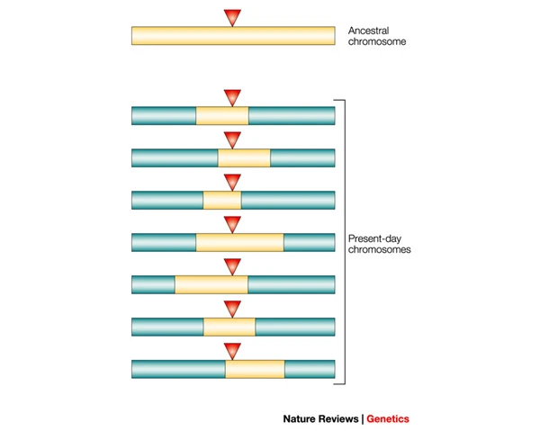

# Tutorial 7: Linkage Disequilibrium, Correlated Features, and PCA

## Biological Background: Linkage Disequilibrium

The genome is inherited in chunks, rather than individual SNPs/nucleotides. Based on how these chunks are generated during recombination (a process during meiosis) some alleles are inherited in a non-random manner - linking their presence. Effectively, groups of alleles become linked, or correlated.

{width="453"}

**Linkage disequilibrium (LD)** is the statistical term for this phenomenon: the non-random association of alleles at two or more loci in a population. Using squared pearson correlation we measure the amount of LD:

$r^2\to 1\implies$ the two SNPs are in LD - knowing one allows you to perfectly infer the other

$r^2\to 0\implies$ the two SNPs are in complete linkage equilibrium - inherited independently

### LD Blocks (or LD "clusters")

LD is not uniform across the genome; there are groups of SNPs that are in LD, but not between each other as they are separated by hotspots. Within a block, a small number of tag SNPs can represent all the variation. Between blocks, SNPs are largely uncorrelated. In ML/statistics, LD produces correlated features (or inputs): imagine SNP1 and SNP2 have an $r^2=0.9$, implying they are collinear, adds redundancy but not independent information. This concept extends to more than two SNPs where many SNPs are correlated.

## Technical Background: PCA and the Effect of Correlated Features

PCA finds a set of orthogonal directions (principal components, PCs) that sequentially maximize variance in the data. Given a genotype matrix **G** (samples × SNPs), PCA decomposes it using SVD:

$$\mathbf{G} \approx \mathbf{U} \mathbf{\Sigma} \mathbf{V}^T$$

The columns of **U** are the sample coordinates (what you plot). The columns of **V** are the SNP loadings (how much each SNP contributes to each PC), and **Σ** is a diagonal matrix of singular values whose squares are proportional to variance explained.

### Correlated Features Distort PCA

Consider an LD block with 300 measured SNPs all in high correlation due to co-inheritance. The genotype matrix would contain \~300 near-identical columns. The resulting SVD (PCA) may separate the LD block(s) from the rest of the SNPs in the first few components because the region drives variance - unfortunately not because it is biologically meaningful. This results in:

-   PC1 or PC2 being driven by entirely the haplotype state of that one LD block
-   Population structure signal (the thing we actually want) gets displaced to PC3, PC4, or lower

```         
         SNP_1  SNP_2  SNP_3
Sample_1    0      0      1
Sample_2    1      1      0
Sample_3    2      2      1
Sample_4    0      0      2
Sample_5    1      1      0
```

### Can we fix this? LD pruning

LD pruning reduces the feature set (SNPs) so that no two retained SNPs exceed a given $r^2$ threshold. One approach, such as in plink, can be using a **window-based pruning** approach which scans the chromosome in chunks and computes pairwise correlations - removing one of two if the correlation exceeds a threshold.

After pruning, the retained SNPs are approximately uncorrelated - aka in linkage equlibrium. Each contributes roughly independent information to the PCA. The top PCs then capture genome-wide structure rather than LD block haplotypes.

# Tuning Correlated Features in PCA

Here, we will explore the impact of correlated features on the PCA with simulated data to understand how LD (blocks) impact visualization.

```{r}
library(ggplot2)
library(gridExtra)
```

```{r}
## HELPER FUNCTIONS MADE WITH CLAUDE: simulate_genotypes, inject_ld_blocks, scale_geno

# Simulate a genotype matrix for n_samples individuals and n_snps independent SNPs.
# Three populations are embedded with different allele frequencies.
# pop_effect controls how different the populations are (0 = no structure).

simulate_genotypes <- function(n_per_pop = 50, n_snps = 200, pop_effect = 0.3) {
  
  n_total <- n_per_pop * 3
  labels  <- rep(c("PopA", "PopB", "PopC"), each = n_per_pop)
  
  # Base allele frequencies for each SNP drawn from Uniform(0.1, 0.5)
  base_freq <- runif(n_snps, 0.1, 0.5)
  
  # Each population has a frequency offset — this creates structure
  freq_A <- pmin(pmax(base_freq + pop_effect * runif(n_snps, -1, 1), 0.05), 0.95)
  freq_B <- pmin(pmax(base_freq + pop_effect * runif(n_snps, -1, 1), 0.05), 0.95)
  freq_C <- pmin(pmax(base_freq + pop_effect * runif(n_snps, -1, 1), 0.05), 0.95)
  
  G <- matrix(NA, nrow = n_total, ncol = n_snps)
  for (i in 1:n_per_pop) {
    G[i,                  ] <- rbinom(n_snps, 2, freq_A)
    G[i + n_per_pop,      ] <- rbinom(n_snps, 2, freq_B)
    G[i + 2 * n_per_pop,  ] <- rbinom(n_snps, 2, freq_C)
  }
  
  list(G = G, labels = labels)
}

# Inject n_blocks correlated LD blocks, each of block_size SNPs.
# A single "founder" SNP is drawn per block; all other SNPs are copies with added noise.
# noise_sd controls imperfection of the correlation (lower = higher r²).

inject_ld_blocks <- function(G, n_blocks = 0, block_size = 20, noise_sd = 0.3) {
  
  if (n_blocks == 0) return(G)
  
  n_samples  <- nrow(G)
  extra_cols <- matrix(NA, nrow = n_samples, ncol = n_blocks * block_size)
  
  col_idx <- 1
  for (b in 1:n_blocks) {
    founder_freq <- runif(1, 0.2, 0.5)
    founder      <- rbinom(n_samples, 2, founder_freq)
    
    for (s in 1:block_size) {
      copy <- round(founder + rnorm(n_samples, 0, noise_sd))
      copy <- pmin(pmax(copy, 0), 2)
      extra_cols[, col_idx] <- copy
      col_idx <- col_idx + 1
    }
  }
  
  cbind(G, extra_cols)
}

# Scale a genotype matrix (mean-center, unit variance per SNP).
# Missing values are mean-imputed (set to 0 after scaling).

scale_geno <- function(G) {
  G_sc <- scale(G, center = TRUE, scale = TRUE)
  G_sc[is.na(G_sc)] <- 0
  G_sc
}
```

## Clean vs. High LD scenerios

Lets run PCA on two of the same datasets, one without LD and the other with LD. We can create an LD-high version using "inject_ld_blocks"

```{r}
sim_clean = simulate_genotypes(n_per_pop = 100, n_snps = 1000, pop_effect = 0.2)
G_clean = scale_geno(sim_clean$G)

G_ld = inject_ld_blocks(sim_clean$G, n_blocks = 20, block_size = 60)
G_ld = scale_geno(G_ld)
```

Compute pcas with "prcomp": e.g. prcomp(G_clean, center = FALSE, scale. = FALSE). Then plot.

```{r fig.height=5, fig.width=11}
pca_clean <- prcomp(G_clean, center = FALSE, scale. = FALSE)
pca_ld <- prcomp(G_ld, center = FALSE, scale. = FALSE)

df_clean <- data.frame(PC1 = pca_clean$x[,1], PC2 = pca_clean$x[,2], pop = sim_clean$labels)
df_ld <- data.frame(PC1 = pca_ld$x[,1], PC2 = pca_ld$x[,2], pop = sim_clean$labels)

p1 <- ggplot(df_clean, aes(PC1, PC2, color = pop)) +
  geom_point(size = 2, alpha = 0.8) +
  theme_minimal() +
  labs(title = "No LD blocks (0 correlated features)",
       color = "Population") +
  theme(legend.position = "bottom")

p2 <- ggplot(df_ld, aes(PC1, PC2, color = pop)) +
  geom_point(size = 2, alpha = 0.8) +
  theme_minimal() +
  labs(title = "LD blocks x SNPs",
       color = "Population") +
  theme(legend.position = "bottom")

grid.arrange(p1, p2, ncol = 2)
```

```{r fig.height=5, fig.width=10}
## Correlation computed with code from CLAUDE -- has not been robustly checked
# Compute eta^2 for every PC: SS_between / SS_total from one-way ANOVA
eta_sq <- function(scores, groups) {
  grand_mean  <- mean(scores)
  ss_total    <- sum((scores - grand_mean)^2)
  group_means <- tapply(scores, groups, mean)
  group_ns    <- tapply(scores, groups, length)
  ss_between  <- sum(group_ns * (group_means - grand_mean)^2)
  ss_between / ss_total
}
# Run for both clean and _ld PCA
n_pcs    <- 15
eta_clean <- sapply(1:n_pcs, function(i) eta_sq(pca_clean$x[, i], sim_clean$labels))
eta_ld   <- sapply(1:n_pcs, function(i) eta_sq(pca_ld$x[, i],   sim_clean$labels))
eta_df <- data.frame(
  PC        = rep(1:n_pcs, 2),
  eta2      = c(eta_clean, eta_ld),
  Condition = rep(c("No LD blocks", "LD blocks"), each = n_pcs)
)
ggplot(eta_df, aes(x = PC, y = eta2, color = Condition)) +
  geom_line(linewidth = 0.9) +
  geom_point(size = 2) +
  scale_x_continuous(breaks = seq(1, n_pcs, by = 2)) +
  scale_color_manual(values = c("No LD blocks" = "#2A9D8F",
                                "LD blocks" = "#E63946")) +
  theme_minimal(base_size = 11) +
  labs(
    title = "Population signal (η²) per PC: clean vs. LD-inflated",
    x     = "Principal Component",
    y     = "η² (variance in PC explained by population)",
    color = NULL
  ) +
  theme(legend.position = "bottom",
        plot.title = element_text(face = "bold"))
```

**Tip for quiz: play around with different n_blocks when computing "G_ld" to see how it changes how the signal becomes distributed among the PCs. KEEP block_size STATIC. Changing "n_pcs" in the plotting code to 100 may help.**
